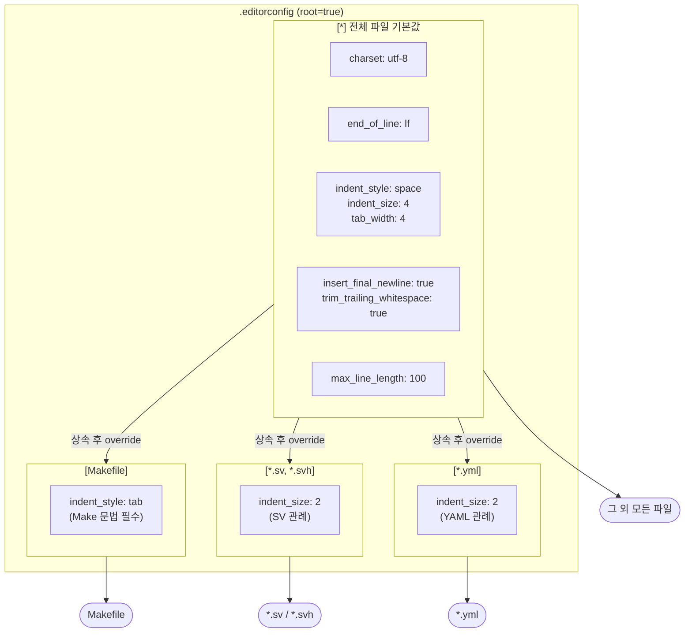

# .editorconfig

## 개요

에디터/IDE의 코드 스타일 설정을 통일하는 파일입니다.  
팀원마다 다른 에디터(VS Code, Vim, CLion, Emacs 등)를 사용하더라도  
`.editorconfig`가 있으면 동일한 포맷 규칙이 자동 적용됩니다.

`root = true`로 선언되어 있어, 이 파일이 최상위 설정임을 나타냅니다.  
에디터는 이 파일을 발견하면 상위 디렉터리 탐색을 중단합니다.

## 규칙 구성

### 전체 파일 기본값 (`[*]`)

| 항목 | 값 | 설명 |
|------|----|------|
| `charset` | `utf-8` | 파일 인코딩 |
| `end_of_line` | `lf` | 줄바꿈 문자 (`\n`). Windows의 CRLF(`\r\n`) 혼입 방지 |
| `indent_style` | `space` | 들여쓰기에 스페이스 사용 |
| `indent_size` | `4` | 기본 들여쓰기 4칸 |
| `tab_width` | `4` | 탭 문자 표시 폭 4칸 |
| `insert_final_newline` | `true` | 파일 끝에 빈 줄 삽입 (POSIX 표준) |
| `trim_trailing_whitespace` | `true` | 줄 끝 공백 자동 제거 |
| `max_line_length` | `100` | 한 줄 최대 100자 |

### 파일 타입별 예외 규칙

| 대상 | 항목 | 값 | 이유 |
|------|------|----|------|
| `Makefile` | `indent_style` | `tab` | Make 문법상 레시피 앞에 탭이 필수 |
| `*.sv`, `*.svh` | `indent_size` | `2` | SystemVerilog 관례상 2칸 들여쓰기 |
| `*.yml` | `indent_size` | `2` | YAML 관례상 2칸 들여쓰기 |

## Block Diagram

## 에디터별 지원 현황

| 에디터 / IDE | 지원 방식 |
|-------------|----------|
| VS Code | 기본 내장 |
| JetBrains (CLion, IntelliJ 등) | 기본 내장 |
| Vim / Neovim | `editorconfig-vim` 플러그인 |
| Emacs | `editorconfig-emacs` 플러그인 |
| Sublime Text | `EditorConfig` 패키지 |

공식 사이트: https://editorconfig.org
