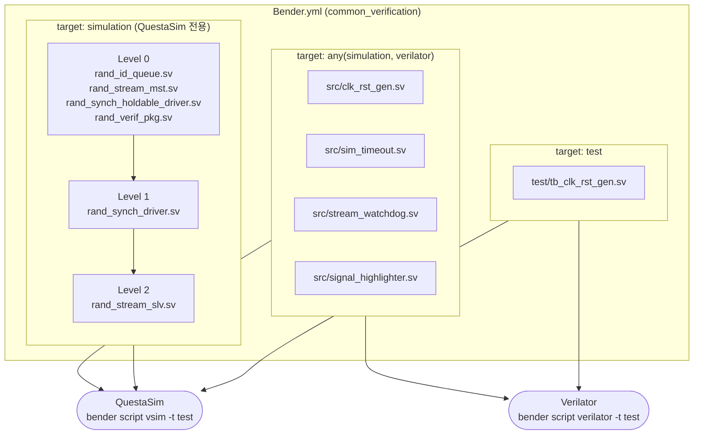

# Bender.yml

## 개요

**Bender** 패키지 매니저의 패키지 정의 파일입니다.  
Bender는 ETH Zurich / lowRISC 생태계에서 주로 사용되는 하드웨어 IP 의존성 관리 도구로,  
`sources` 블록의 `target` 조건을 통해 시뮬레이터·툴별로 다른 파일 집합을 제공합니다.

## 패키지 정보

```yaml
package:
  name: common_verification
  authors:
    - "Andreas Kurth <akurth@iis.ee.ethz.ch>"
```

| 항목 | 값 |
|------|----|
| `name` | `common_verification` |
| `authors` | Andreas Kurth (ETH Zurich IIS) |

## Sources

파일 목록은 `target` 조건으로 구분됩니다.  
`bender script <tool> -t <target>` 명령으로 조건에 맞는 파일 목록을 출력합니다.

### `any(simulation, verilator)` — 공통 시뮬레이션 파일

QuestaSim(`simulation`)과 Verilator(`verilator`) 양쪽에서 모두 포함되는 파일입니다.

| 파일 | 설명 |
|------|------|
| `src/clk_rst_gen.sv` | 클럭/리셋 생성기 |
| `src/sim_timeout.sv` | 시뮬레이션 타임아웃 |
| `src/stream_watchdog.sv` | 스트림 감시자 |
| `src/signal_highlighter.sv` | 파형 신호 강조기 |

### `simulation` — QuestaSim 전용 파일

`rand` 조건부, OOP 클래스 등 Verilator 미지원 기능을 사용하는 파일입니다.

| 레벨 | 파일 | 설명 |
|------|------|------|
| 0 | `src/rand_id_queue.sv` | ID별 랜덤 출력 큐 (SV 클래스) |
| 0 | `src/rand_stream_mst.sv` | 랜덤 스트림 마스터 |
| 0 | `src/rand_synch_holdable_driver.sv` | 일시정지 가능 랜덤 동기 드라이버 |
| 0 | `src/rand_verif_pkg.sv` | 공통 검증 패키지 |
| 1 | `src/rand_synch_driver.sv` | 랜덤 동기 드라이버 (Level 0 의존) |
| 2 | `src/rand_stream_slv.sv` | 랜덤 스트림 슬레이브 (Level 1 의존) |

### `test` — 테스트벤치 파일

| 파일 | 설명 |
|------|------|
| `test/tb_clk_rst_gen.sv` | `clk_rst_gen` 테스트벤치 |

## Target 조건 체계

```
simulation ──┐
             ├─ any(simulation, verilator) → 공통 파일 포함
verilator  ──┘

simulation 단독 → rand* 계열 파일 추가 포함

test → 테스트벤치 파일 포함 (명시적으로 -t test 지정 시)
```

## Block Diagram



## 사용 예시

```bash
# QuestaSim용 컴파일 스크립트 생성
bender script vsim -t test \
    --vlog-arg="-svinputport=compat" \
    --vlog-arg="-override_timescale 1ns/1ps" \
    > compile.tcl

# Verilator용 파일 목록 생성
bender script verilator -t test > verilator.f
verilator --cc -f verilator.f --top-module tb_clk_rst_gen ...
```

## fusesoc.core와의 비교

| 항목 | `Bender.yml` | `fusesoc.core` |
|------|-------------|---------------|
| 빌드 시스템 | Bender | FuseSoC |
| 조건 표현 | `target: any(simulation, verilator)` | `targets:` 블록 |
| Verilator 지원 | `any(simulation, verilator)` 조건 내장 | 별도 타겟 필요 |
| 의존성 참조 | Git URL 직접 참조 | 중앙 레지스트리 / 로컬 경로 |
| 사용 생태계 | ETH Zurich / lowRISC | PULP Platform |
