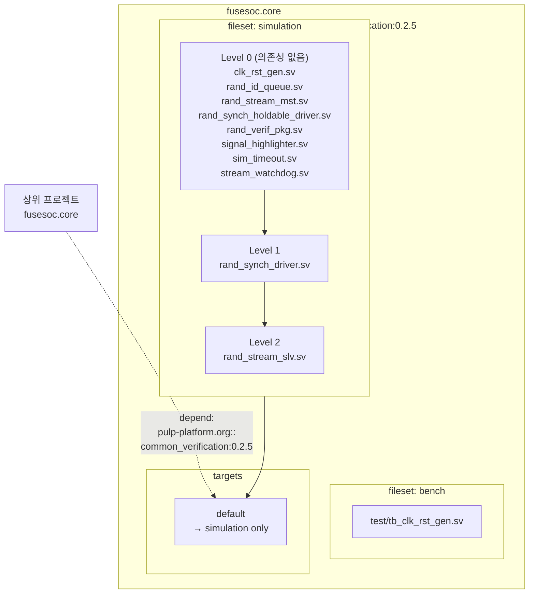

# fusesoc.core

## 개요

**FuseSoC** 빌드 시스템의 패키지 정의 파일입니다.  
FuseSoC는 하드웨어 IP 코어를 위한 패키지 매니저 겸 빌드 시스템으로,  
다양한 시뮬레이터(QuestaSim, VCS, Xsim 등) 및 합성 툴에 대한 빌드를 자동화합니다.

## 패키지 식별자

```
pulp-platform.org::common_verification:0.2.5
```

| 필드 | 값 | 설명 |
|------|----|------|
| vendor | `pulp-platform.org` | 패키지 제공자 |
| library | `common_verification` | 패키지 이름 |
| version | `0.2.5` | 패키지 버전 |

다른 프로젝트의 `fusesoc.core`에서 아래와 같이 의존성으로 참조합니다:

```yaml
depend:
  - pulp-platform.org::common_verification:0.2.5
```

## Filesets

파일을 용도별로 묶는 단위입니다.

### `simulation`

시뮬레이션 전용 소스 파일 그룹입니다.  
파일은 의존성 순서에 따라 레벨별로 정렬되어 있습니다.

| 레벨 | 파일 | 설명 |
|------|------|------|
| 0 | `src/clk_rst_gen.sv` | 클럭/리셋 생성기 |
| 0 | `src/rand_id_queue.sv` | ID별 랜덤 출력 큐 |
| 0 | `src/rand_stream_mst.sv` | 랜덤 스트림 마스터 |
| 0 | `src/rand_synch_holdable_driver.sv` | 일시정지 가능 랜덤 동기 드라이버 |
| 0 | `src/rand_verif_pkg.sv` | 공통 검증 패키지 |
| 0 | `src/signal_highlighter.sv` | 파형 신호 강조기 |
| 0 | `src/sim_timeout.sv` | 시뮬레이션 타임아웃 |
| 0 | `src/stream_watchdog.sv` | 스트림 감시자 |
| 1 | `src/rand_synch_driver.sv` | 랜덤 동기 드라이버 (Level 0 의존) |
| 2 | `src/rand_stream_slv.sv` | 랜덤 스트림 슬레이브 (Level 1 의존) |

- `file_type`: `systemVerilogSource`

### `bench`

테스트벤치 파일 그룹입니다.

| 파일 | 설명 |
|------|------|
| `test/tb_clk_rst_gen.sv` | `clk_rst_gen` 테스트벤치 |

- `file_type`: `systemVerilogSource`

## Targets

| 타겟 | 포함 Fileset | 설명 |
|------|-------------|------|
| `default` | `simulation` | 기본 빌드 타겟. `bench`는 제외되어 상위 프로젝트에 테스트벤치가 노출되지 않음 |

## Block Diagram



## Bender.yml과의 비교

| 항목 | `fusesoc.core` | `Bender.yml` |
|------|---------------|--------------|
| 빌드 시스템 | FuseSoC | Bender |
| 파일 그룹 단위 | `filesets` | `sources` + `target` 조건 |
| 타겟 조건 표현 | `targets` | `target: simulation`, `target: test` 등 |
| 의존성 참조 | 중앙 레지스트리 / 로컬 경로 | Git URL 직접 참조 |
| Verilator 지원 | 별도 타겟 필요 | `any(simulation, verilator)` 조건 내장 |

두 파일은 동일한 소스를 서로 다른 빌드 시스템에 제공하기 위해 병행 관리됩니다.
