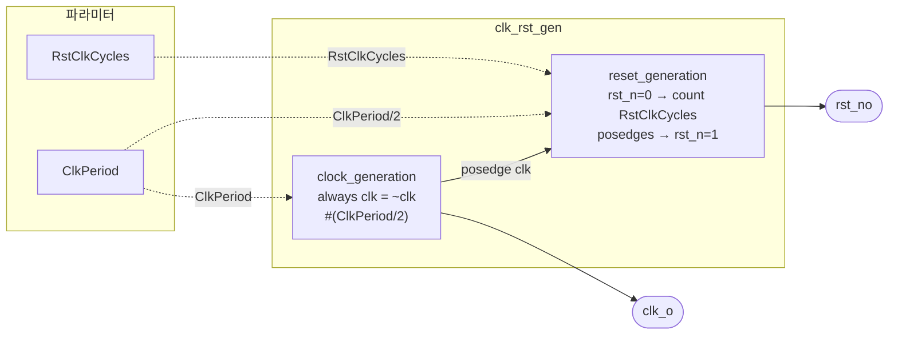

# clk_rst_gen

## 개요

클럭과 액티브-로우 리셋 신호를 생성하는 독립형 시뮬레이션 모듈입니다.  
합성 불가 (`initial`, `always` 시간 지연 사용). Verilator 지원 (`\`ifndef VERILATOR` 가드 적용).

## 파라미터

| 파라미터 | 타입 | 기본값 | 설명 |
|----------|------|--------|------|
| `ClkPeriod` | `realtime` | `0ps` | 클럭 주기 (최소 2ps) |
| `RstClkCycles` | `int unsigned` | `0` | 리셋 유지 클럭 사이클 수 |

## 포트

| 포트 | 방향 | 타입 | 설명 |
|------|------|------|------|
| `clk_o` | output | `logic` | 클럭 출력 |
| `rst_no` | output | `logic` | 액티브-로우 리셋 출력 |

## 동작 설명

### 클럭 생성
- `initial` 블록에서 `clk = 0` 초기화
- `always` 블록에서 `ClkPeriod/2` 마다 반전 → 50% duty cycle 클럭

### 리셋 생성
- 시뮬레이션 시작과 동시에 `rst_n = 0` (리셋 어서트)
- `ClkPeriod/2` 대기 후 첫 complete 클럭 사이클부터 카운트 시작
- `RstClkCycles`번 `posedge clk`를 기다린 후 `rst_n = 1` (디어서트)

### 파라미터 검증 (Verilator 제외)
- `ClkPeriod >= 2ps` 미만이면 `$fatal`
- `RstClkCycles > 0` 아니면 `$fatal`

## Block Diagram



## 타이밍 다이어그램

```
         ┌───┐   ┌───┐   ┌───┐   ┌───┐   ┌───┐   ┌───┐
clk_o    ┘   └───┘   └───┘   └───┘   └───┘   └───┘   └──
         ←ClkPeriod→

rst_no   ──────────────────────────────────┐
                 ↑RstClkCycles=3           └─────────────
         ←←←←←ClkPeriod/2→→→→→
```
