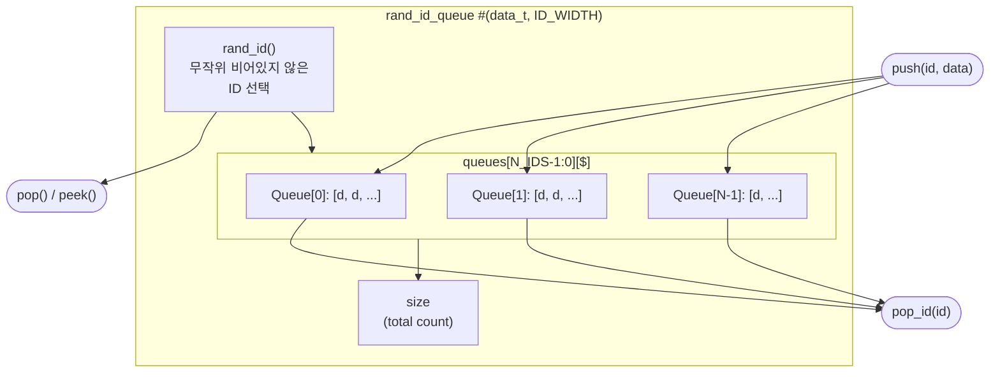

# rand_id_queue

## 개요

ID별로 독립적인 큐를 관리하며, 출력 시 비어 있지 않은 큐 중 하나를 **무작위**로 선택하는 SV 클래스입니다.  
`rand_id_queue_pkg` 패키지 안에 정의되며 `import rand_id_queue_pkg::*;`로 사용합니다.  
시뮬레이션 전용 (OOP 클래스).

## 파라미터

| 파라미터 | 타입 | 기본값 | 설명 |
|----------|------|--------|------|
| `data_t` | `type` | `logic` | 저장할 데이터 타입 |
| `ID_WIDTH` | `int unsigned` | `0` | ID 비트 폭 (`N_IDS = 2^ID_WIDTH` 개 큐) |

## 내부 구조

| 멤버 | 타입 | 설명 |
|------|------|------|
| `queues[N_IDS-1:0][$]` | `data_t` 동적 배열 | ID별 FIFO 큐 |
| `size` | `int unsigned` | 전체 저장 요소 수 |

## 메서드

| 메서드 | 반환 | 설명 |
|--------|------|------|
| `push(id, data)` | `void` | 해당 ID 큐 뒤에 데이터 삽입 |
| `pop()` | `data_t` | 랜덤 비어있지 않은 큐에서 앞 요소 제거 후 반환 |
| `pop_id(id)` | `data_t` | 지정 ID 큐에서 앞 요소 제거 후 반환 |
| `peek()` | `data_t` | 랜덤 큐의 앞 요소 확인 (제거 없음) |
| `rand_id()` | `id_t` | 비어 있지 않은 큐 ID를 무작위 선택 |
| `get(id)` | `data_t` | 지정 ID 큐의 앞 요소 반환 (제거 없음) |
| `set(id, data)` | `void` | 지정 ID 큐의 앞 요소 덮어쓰기 |
| `empty()` | `bit` | 전체 큐가 비어 있으면 1 (하위 호환) |
| `is_empty()` | `bit` | 전체 큐가 비어 있으면 1 |

## Block Diagram



## 사용 예시

```systemverilog
import rand_id_queue_pkg::*;

rand_id_queue #(.data_t(logic [7:0]), .ID_WIDTH(4)) iq;
iq = new();

iq.push(4'h3, 8'hAB);
iq.push(4'h3, 8'hCD);
iq.push(4'h7, 8'h12);

data = iq.pop();    // ID 3 또는 7에서 무작위 선택
data = iq.pop_id(4'h3);  // 반드시 ID 3에서 pop
```
