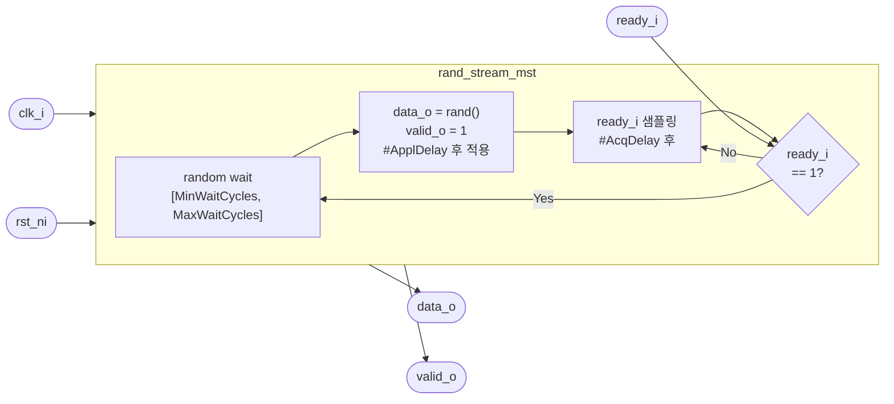

# rand_stream_mst

## 개요

Ready/Valid 스트림 인터페이스에 랜덤 데이터를 구동하는 **스트림 마스터** 시뮬레이션 모듈입니다.  
트랜잭션 사이에 무작위 대기 사이클을 삽입하여 백프레셔 등 다양한 타이밍 패턴을 생성합니다.  
시뮬레이션 전용 (합성 불가).

## 파라미터

| 파라미터 | 타입 | 기본값 | 설명 |
|----------|------|--------|------|
| `data_t` | `type` | `logic` | 스트림 데이터 타입 |
| `MinWaitCycles` | `int` | `-1` | 연속 전송 사이 최소 대기 사이클 |
| `MaxWaitCycles` | `int` | `-1` | 연속 전송 사이 최대 대기 사이클 |
| `ApplDelay` | `time` | `0ps` | 클럭 엣지 후 출력 변경까지의 지연 |
| `AcqDelay` | `time` | `0ps` | 클럭 엣지 후 ready 샘플링까지의 지연 (`> ApplDelay` 필수) |

## 포트

| 포트 | 방향 | 타입 | 설명 |
|------|------|------|------|
| `clk_i` | input | `logic` | 클럭 |
| `rst_ni` | input | `logic` | 액티브-로우 리셋 |
| `data_o` | output | `data_t` | 스트림 데이터 |
| `valid_o` | output | `logic` | 데이터 유효 신호 |
| `ready_i` | input | `logic` | 슬레이브 준비 신호 |

## 동작 설명

1. 리셋 해제 대기 (`wait(rst_ni)`)
2. 무작위 대기 사이클 결정
3. 지정 사이클 대기 후 `ApplDelay` 경과 시점에 랜덤 데이터와 `valid=1` 구동
4. `AcqDelay` 시점에 `ready_i` 샘플링. `ready=0`이면 다음 클럭 엣지에서 재샘플링
5. 핸드셰이크 완료 후 다음 대기 사이클 결정, `valid=0` 으로 되돌림(대기 사이클 > 0인 경우)

## Block Diagram



## 타이밍 다이어그램

```
         ┌─┐ ┌─┐ ┌─┐ ┌─┐ ┌─┐ ┌─┐ ┌─┐ ┌─┐
clk_i    ┘ └─┘ └─┘ └─┘ └─┘ └─┘ └─┘ └─┘ └─

         ←wait→     ←ApplDelay→
valid_o  ──────────────┐           ┌──────
                       └───────────┘
data_o   ──────────────┤  DATA_A   ├──────

ready_i  ────────────────────────┐ ┌──────
                                 └─┘
         ← AcqDelay 시점에 샘플링 ↑
```
