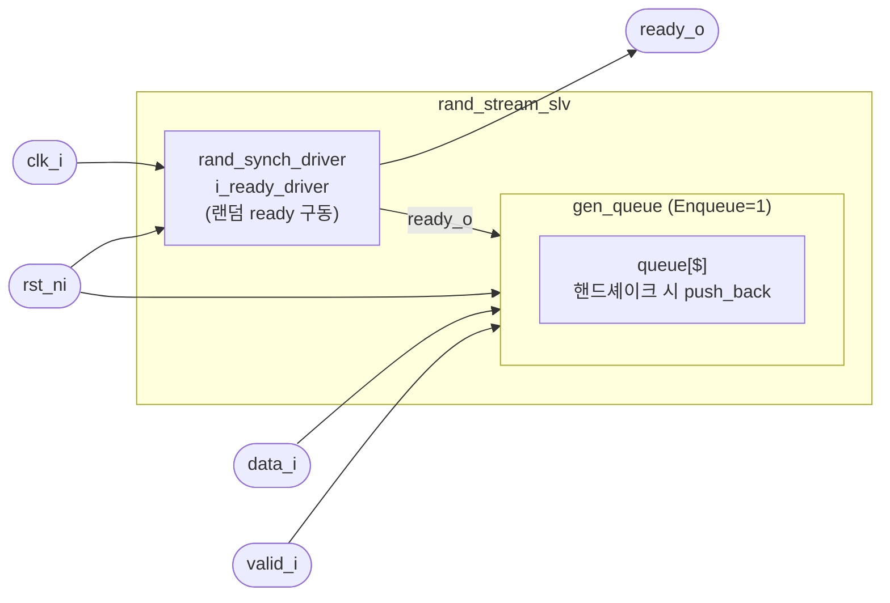

# rand_stream_slv

## 개요

Ready/Valid 스트림 인터페이스에서 `ready` 신호를 무작위로 구동하는 **스트림 슬레이브** 시뮬레이션 모듈입니다.  
내부적으로 `rand_synch_driver`를 이용해 `ready_o`를 랜덤하게 토글합니다.  
`Enqueue=1` 설정 시 수신된 데이터를 내부 큐에 저장합니다.  
시뮬레이션 전용 (합성 불가).

## 파라미터

| 파라미터 | 타입 | 기본값 | 설명 |
|----------|------|--------|------|
| `data_t` | `type` | `logic` | 스트림 데이터 타입 |
| `MinWaitCycles` | `int` | `-1` | ready 구동 사이 최소 대기 사이클 |
| `MaxWaitCycles` | `int` | `-1` | ready 구동 사이 최대 대기 사이클 |
| `ApplDelay` | `time` | `0ps` | 클럭 엣지 후 ready 변경까지 지연 |
| `AcqDelay` | `time` | `0ps` | 수신 데이터 캡처 지연 (`> ApplDelay` 필수) |
| `Enqueue` | `bit` | `0` | 1이면 수신 데이터를 내부 큐에 저장 |

## 포트

| 포트 | 방향 | 타입 | 설명 |
|------|------|------|------|
| `clk_i` | input | `logic` | 클럭 |
| `rst_ni` | input | `logic` | 액티브-로우 리셋 |
| `data_i` | input | `data_t` | 스트림 데이터 입력 |
| `valid_i` | input | `logic` | 마스터 valid 신호 |
| `ready_o` | output | `logic` | 슬레이브 ready 신호 |

## 내부 구조

- `rand_synch_driver` 인스턴스(`i_ready_driver`)가 `ready_o`를 랜덤 구동
- `Enqueue=1`이면 `always_ff`로 핸드셰이크(`valid_i & ready_o`) 감지 후 `queue[]`에 저장

## Block Diagram

