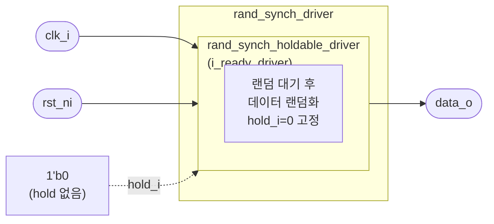

# rand_synch_driver

## 개요

`rand_synch_holdable_driver`의 래퍼 모듈로, `hold_i`를 항상 `0`으로 고정하여  
일시 정지(hold) 기능 없이 순수하게 랜덤 데이터를 구동하는 **동기 드라이버**입니다.  
시뮬레이션 전용 (합성 불가).

## 파라미터

| 파라미터 | 타입 | 기본값 | 설명 |
|----------|------|--------|------|
| `data_t` | `type` | `logic` | 출력 데이터 타입 |
| `MinWaitCycles` | `int` | `-1` | 연속 구동 사이 최소 대기 사이클 |
| `MaxWaitCycles` | `int` | `-1` | 연속 구동 사이 최대 대기 사이클 |
| `ApplDelay` | `time` | `0ps` | 클럭 엣지 후 출력 변경까지 지연 |

## 포트

| 포트 | 방향 | 타입 | 설명 |
|------|------|------|------|
| `clk_i` | input | `logic` | 클럭 |
| `rst_ni` | input | `logic` | 액티브-로우 리셋 |
| `data_o` | output | `data_t` | 랜덤 데이터 출력 |

## Block Diagram

## 관련 모듈

- [`rand_synch_holdable_driver`](rand_synch_holdable_driver.sv.md): hold 기능 포함 버전
