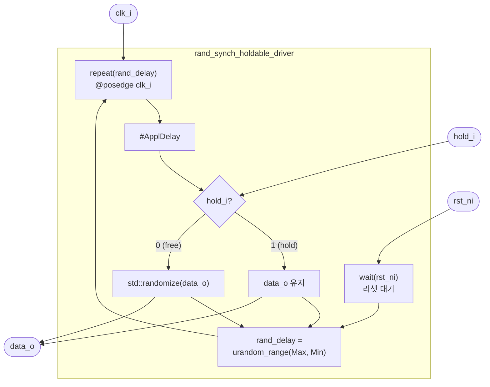

# rand_synch_holdable_driver

## 개요

랜덤 데이터를 동기적으로 구동하되, `hold_i=1`일 때는 현재 출력을 유지하는  
**일시 정지 가능한 동기 드라이버**입니다.  
시뮬레이션 전용 (합성 불가).

## 파라미터

| 파라미터 | 타입 | 기본값 | 설명 |
|----------|------|--------|------|
| `data_t` | `type` | `logic` | 출력 데이터 타입 |
| `MinWaitCycles` | `int` | `-1` | 연속 구동 사이 최소 대기 사이클 |
| `MaxWaitCycles` | `int` | `-1` | 연속 구동 사이 최대 대기 사이클 |
| `ApplDelay` | `time` | `0ps` | 클럭 엣지 후 출력 변경까지 지연 |

## 포트

| 포트 | 방향 | 타입 | 설명 |
|------|------|------|------|
| `clk_i` | input | `logic` | 클럭 |
| `rst_ni` | input | `logic` | 액티브-로우 리셋 |
| `hold_i` | input | `logic` | 1이면 현재 출력 유지, 0이면 새 랜덤값 적용 |
| `data_o` | output | `data_t` | 랜덤 데이터 출력 |

## 동작 설명

1. 리셋 해제 대기 (`wait(rst_ni)`)
2. 첫 `posedge clk_i` 대기
3. 루프:
   - `$urandom_range(MaxWaitCycles, MinWaitCycles)`로 대기 사이클 결정
   - 해당 사이클만큼 클럭 대기
   - `#ApplDelay` 경과 후:
     - `hold_i == 0` → `std::randomize(data_o)` 새 값 적용
     - `hold_i == 1` → 현재 값 유지

## 파라미터 검증 (Verilator 제외)

- `MinWaitCycles >= 0`
- `MaxWaitCycles >= 0`
- `MaxWaitCycles >= MinWaitCycles`
- `ApplDelay > 0ps`

## Block Diagram

## 관련 모듈

- [`rand_synch_driver`](rand_synch_driver.sv.md): hold 없이 항상 랜덤 구동하는 래퍼
