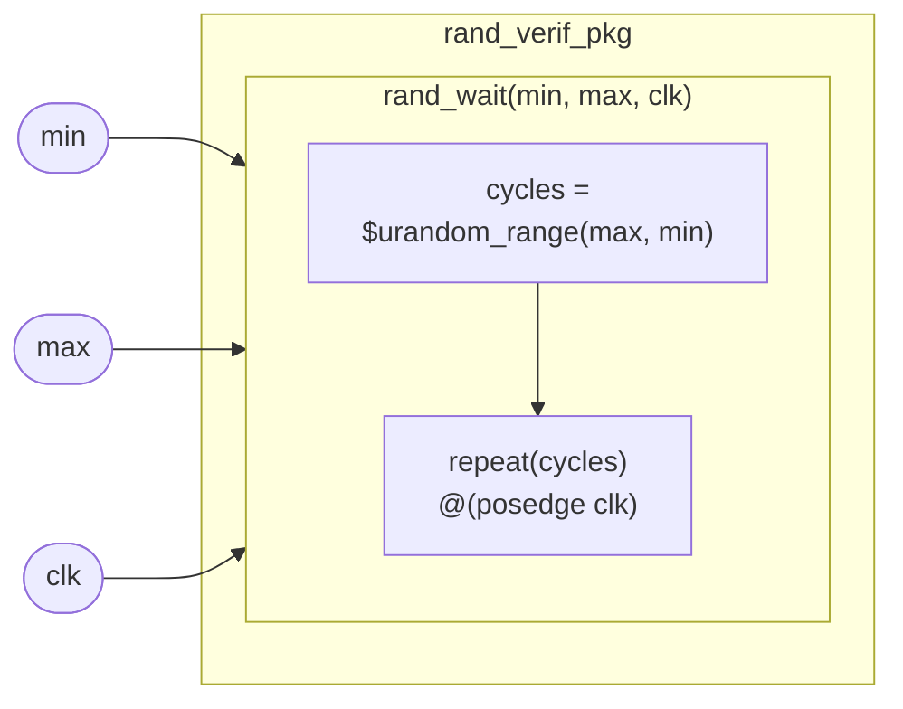

# rand_verif_pkg

## 개요

Constrained-random 검증에 자주 사용되는 공통 함수/태스크를 정의하는 **SV 패키지**입니다.  
`import rand_verif_pkg::*;`로 임포트하여 사용합니다.  
시뮬레이션 전용.

## 태스크

### `rand_wait`

```systemverilog
task automatic rand_wait(input int unsigned min, max, ref logic clk);
```

| 인자 | 방향 | 타입 | 설명 |
|------|------|------|------|
| `min` | input | `int unsigned` | 대기 사이클 최솟값 |
| `max` | input | `int unsigned` | 대기 사이클 최댓값 |
| `clk` | ref | `logic` | 기준 클럭 신호 |

`[min, max]` 구간에서 무작위 정수를 선택하여 해당 횟수만큼 `posedge clk`를 대기합니다.  
`$urandom_range(max, min)` 사용.

## Block Diagram



## 사용 예시

```systemverilog
import rand_verif_pkg::*;

// 3~10 사이클 무작위 대기
rand_wait(3, 10, clk);
```
