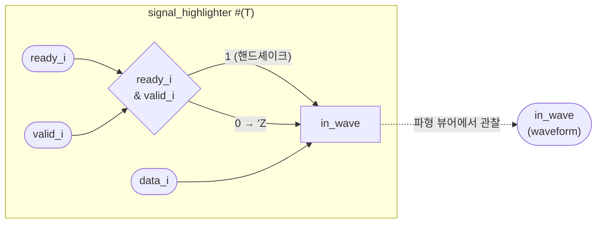

# signal_highlighter

## 개요

Ready/Valid 핸드셰이크가 **발생하는 순간의 데이터**를 파형(waveform) 뷰어에서  
별도 신호로 강조 표시하는 시뮬레이션 보조 모듈입니다.

핸드셰이크가 없을 때는 출력이 `'Z`(Hi-Z)로 되어 파형 상에서 공백으로 표시되므로,  
유효 데이터 전송 시점만 시각적으로 부각됩니다.  
클럭/리셋 없음 (조합 논리만 사용). 시뮬레이션 전용.

## 파라미터

| 파라미터 | 타입 | 기본값 | 설명 |
|----------|------|--------|------|
| `T` | `type` | `logic` | 모니터링할 데이터 타입 |

## 포트

| 포트 | 방향 | 타입 | 설명 |
|------|------|------|------|
| `ready_i` | input | `logic` | 스트림 ready 신호 |
| `valid_i` | input | `logic` | 스트림 valid 신호 |
| `data_i` | input | `T` | 스트림 데이터 |

## 내부 신호

| 신호 | 타입 | 설명 |
|------|------|------|
| `in_wave` | `T` | 파형 뷰어에서 관찰할 내부 신호 |

## 동작 설명

```
in_wave = (ready_i & valid_i) ? data_i : 'Z
```

파형 뷰어에서 `in_wave`를 추가하면, 핸드셰이크 사이클에만 데이터 값이 표시됩니다.

## Block Diagram



## 사용 예시

```systemverilog
signal_highlighter #(.T(logic [31:0])) i_hl (
    .ready_i (ready),
    .valid_i (valid),
    .data_i  (data)
);
// 파형 뷰어에서 i_hl/in_wave 신호를 추가하면
// 핸드셰이크 발생 사이클에만 데이터가 표시됨
```
