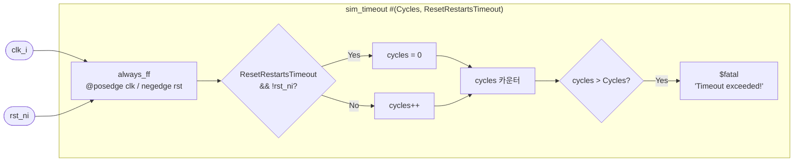

# sim_timeout

## 개요

시뮬레이션이 지정된 클럭 사이클을 초과하면 `$fatal`로 강제 종료하는  
**시뮬레이션 안전장치** 모듈입니다.  
무한 루프나 데드락 상태에서 시뮬레이션이 영원히 실행되는 것을 방지합니다.  
Verilator 지원 (`\`ifndef VERILATOR` 가드 적용).

## 파라미터

| 파라미터 | 타입 | 기본값 | 설명 |
|----------|------|--------|------|
| `Cycles` | `longint unsigned` | `0` | 타임아웃 사이클 수 (0보다 커야 함) |
| `ResetRestartsTimeout` | `bit` | `0` | 1이면 리셋 발생 시 카운터 초기화 |

## 포트

| 포트 | 방향 | 타입 | 설명 |
|------|------|------|------|
| `clk_i` | input | `logic` | 클럭 |
| `rst_ni` | input | `logic` | 액티브-로우 리셋 |

## 동작 설명

- `always_ff @(posedge clk_i, negedge rst_ni)`
  - `ResetRestartsTimeout=1`이고 `!rst_ni` → `cycles = 0` (카운터 리셋)
  - 그 외 → `cycles++`
  - `cycles > Cycles`이면 `$fatal(1, "Timeout exceeded!")`

## Block Diagram



## 사용 예시

```systemverilog
sim_timeout #(
    .Cycles              (100_000),
    .ResetRestartsTimeout(1'b1)
) i_timeout (
    .clk_i  (clk),
    .rst_ni (rst_n)
);
```
