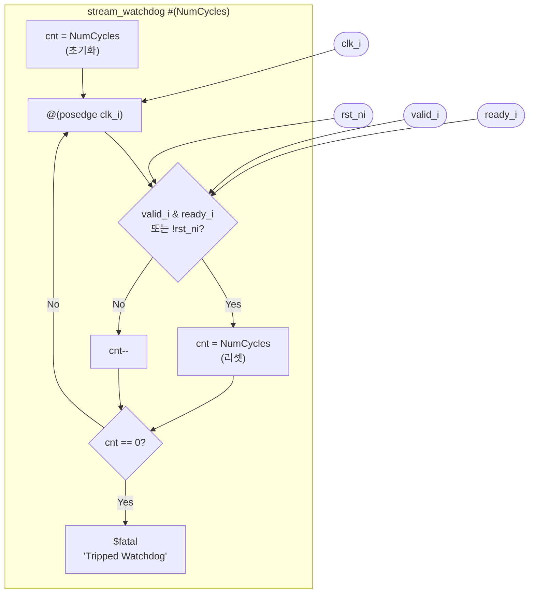

# stream_watchdog

## 개요

Ready/Valid 스트림 핸드셰이크가 `NumCycles` 사이클 동안 발생하지 않으면  
시뮬레이션을 `$fatal`로 강제 종료하는 **스트림 감시자** 모듈입니다.  
데드락이나 스트림 정체 상황을 자동으로 탐지합니다.  
시뮬레이션 전용 (합성 불가).

## 파라미터

| 파라미터 | 타입 | 기본값 | 설명 |
|----------|------|--------|------|
| `NumCycles` | `int unsigned` | (필수) | 허용되는 최대 비활성 사이클 수 |

## 포트

| 포트 | 방향 | 타입 | 설명 |
|------|------|------|------|
| `clk_i` | input | `logic` | 클럭 |
| `rst_ni` | input | `logic` | 액티브-로우 리셋 |
| `valid_i` | input | `logic` | 스트림 valid 신호 |
| `ready_i` | input | `logic` | 스트림 ready 신호 |

## 동작 설명

- `initial` 블록에서 카운터 `cnt = NumCycles`로 초기화
- 매 클럭 사이클:
  - `valid_i & ready_i` (핸드셰이크 발생) **또는** `!rst_ni` (리셋 중) → `cnt = NumCycles` 리셋
  - 핸드셰이크 없음 → `cnt--`
- `cnt == 0` → `$fatal(1, "Tripped Watchdog ... at %dns, Inactivity for %d cycles")`

## Block Diagram



## 사용 예시

```systemverilog
stream_watchdog #(.NumCycles(1000)) i_wd (
    .clk_i   (clk),
    .rst_ni  (rst_n),
    .valid_i (stream_valid),
    .ready_i (stream_ready)
);
// 1000 사이클 동안 핸드셰이크가 없으면 시뮬레이션 종료
```
