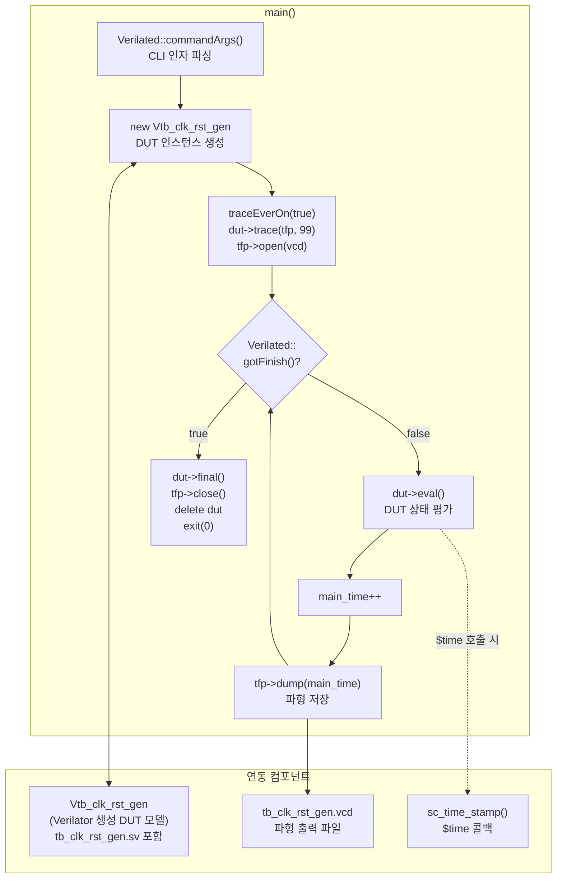

# tb_clk_rst_gen.cpp

## 개요

Verilator로 컴파일된 `tb_clk_rst_gen` SystemVerilog 테스트벤치를 실행하는  
**C++ 시뮬레이션 드라이버**입니다.

DUT 평가 루프를 돌리고 VCD 파형 파일(`tb_clk_rst_gen.vcd`)을 생성합니다.  
실제 테스트 로직(클럭/리셋 카운트 및 assertion)은 `tb_clk_rst_gen.sv`에 있으며,  
이 파일은 Verilator `--timing` 모드 하에서 시뮬레이션을 구동하는 최소한의 하네스 역할을 합니다.

## 의존성

| 헤더 | 출처 | 설명 |
|------|------|------|
| `Vtb_clk_rst_gen.h` | Verilator 생성 (`obj_dir/`) | DUT C++ 모델 클래스 |
| `verilated.h` | Verilator 런타임 | `Verilated::`, `vluint64_t` 등 핵심 API |
| `verilated_vcd_c.h` | Verilator 런타임 | VCD 파형 덤프 지원 |

## 전역 변수

| 변수 | 타입 | 설명 |
|------|------|------|
| `main_time` | `vluint64_t` | 시뮬레이션 타임스탬프 (64비트, 랩어라운드 방지) |

## 함수

### `sc_time_stamp()`

```cpp
double sc_time_stamp();
```

Verilator 런타임이 `$time` 시스템 함수 호출 시 사용하는 콜백.  
`main_time`을 `double`로 변환하여 반환 (SystemC 호환 인터페이스).

### `main()`

```cpp
int main(int argc, char** argv, char** env);
```

시뮬레이션 진입점. 아래 순서로 동작합니다:

1. `Verilated::commandArgs(argc, argv)` — CLI 인자 파싱 (Verilator 내부 플래그 처리)
2. `new Vtb_clk_rst_gen` — DUT 인스턴스 생성
3. VCD 트레이스 설정:
   - `Verilated::traceEverOn(true)` — 전역 트레이스 활성화
   - `dut->trace(tfp, 99)` — 99단계 계층까지 트레이스
   - `tfp->open("tb_clk_rst_gen.vcd")` — 파형 파일 오픈
4. **시뮬레이션 루프** (`while (!Verilated::gotFinish())`):
   - `dut->eval()` — DUT 상태 평가 (SV의 `$finish` 도달 시 루프 탈출)
   - `main_time++` — 타임스탬프 증가
   - `tfp->dump(main_time)` — 현재 시각의 파형 저장
5. `dut->final()` — DUT 종료 처리
6. `tfp->close()` — VCD 파일 닫기
7. `delete dut` / `exit(0)` — 정리 및 종료

## Block Diagram



## 시뮬레이션 흐름

```
프로그램 시작
    │
    ▼
DUT 생성 & VCD 설정
    │
    ▼
┌─────────────────────────────┐
│  eval() → SV 스케줄러 실행  │
│    └─ tb_clk_rst_gen.sv의   │
│       clk/rst 생성 및 체크  │
│  main_time++                │
│  tfp->dump()                │
└──────── $finish 전까지 반복 ┘
    │
    ▼
정리 후 exit(0)
```

## 출력 파일

| 파일 | 설명 |
|------|------|
| `tb_clk_rst_gen.vcd` | Value Change Dump 파형 파일. GTKWave 등으로 열람 가능 |

## 관련 파일

- [`tb_clk_rst_gen.sv`](tb_clk_rst_gen.sv.md): 실제 테스트 로직 (assertion, 카운터)
- `obj_dir/Vtb_clk_rst_gen.h`: Verilator가 생성한 DUT C++ 헤더 (자동 생성, 편집 불필요)
