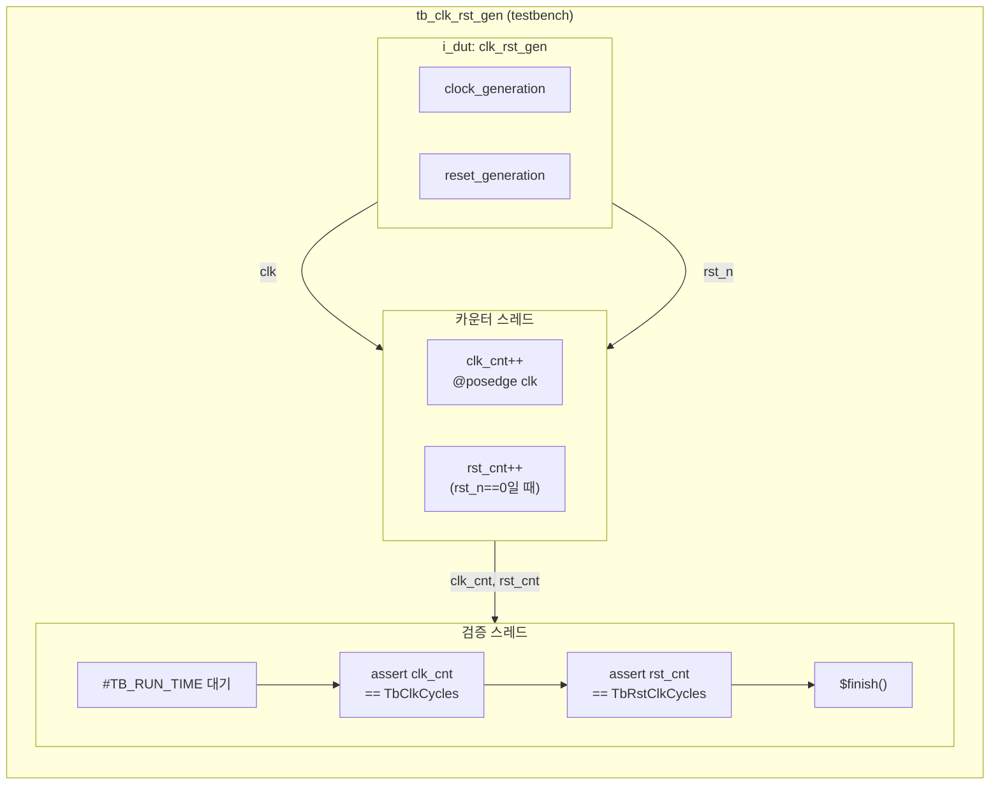

# tb_clk_rst_gen

## 개요

`clk_rst_gen` 모듈을 검증하는 **셀프-체킹 테스트벤치**입니다.  
클럭 사이클 수와 리셋 사이클 수를 직접 카운트하여 기대값과 일치하는지 assertion으로 확인합니다.  
QuestaSim 및 Verilator(`-G` 파라미터 오버라이드) 지원.

## 파라미터

| 파라미터 | 타입 | 기본값 | 설명 |
|----------|------|--------|------|
| `TbClkPeriod` | `time` | `1ns` | DUT 클럭 주기 |
| `TbClkCycles` | `int unsigned` | `12` | 검증할 총 클럭 사이클 수 |
| `TbRstClkCycles` | `int unsigned` | `7` | 검증할 리셋 사이클 수 (`< TbClkCycles` 필수) |
| `TbDebugPrint` | `bit` | `0` | 1이면 각 클럭/리셋 사이클마다 `$info` 출력 |

## 포트

없음 (top-level 테스트벤치).

## 내부 구조

| 인스턴스 | 모듈 | 설명 |
|----------|------|------|
| `i_dut` | `clk_rst_gen` | 검증 대상 (ClkPeriod=TbClkPeriod, RstClkCycles=TbRstClkCycles) |

## 동작 설명

### 카운터 스레드 (initial #1)
- `TbClkPeriod - 1` 대기 후 `posedge clk`마다:
  - `rst_n == 0` → `rst_cnt++`
  - `clk_cnt++`

### 검증 스레드 (initial #2)
1. `TbRstClkCycles < TbClkCycles` 검증 (아니면 `$fatal`)
2. `TB_RUN_TIME = TbClkCycles * TbClkPeriod + TbClkPeriod/2` 경과 대기
3. `clk_cnt == TbClkCycles` assertion (`$error`)
4. `rst_cnt == TbRstClkCycles` assertion (`$error`)
5. `$finish()`

## Block Diagram



## 타이밍 다이어그램

```
         ┌─┐ ┌─┐ ┌─┐ ┌─┐ ┌─┐ ┌─┐ ┌─┐ ┌─┐ ┌─┐ ┌─┐ ┌─┐ ┌─┐
clk      ┘ └─┘ └─┘ └─┘ └─┘ └─┘ └─┘ └─┘ └─┘ └─┘ └─┘ └─┘ └─
         ←← TbRstClkCycles=7 ──────────────────→
rst_n    ──────────────────────────────┐
                                       └───────────────────
clk_cnt  0  1  2  3  4  5  6  7  8  9 10  11 12
rst_cnt  0  1  2  3  4  5  6  7  ←no change→
         ←─────── TbClkCycles=12 ──────────────→$finish
```
