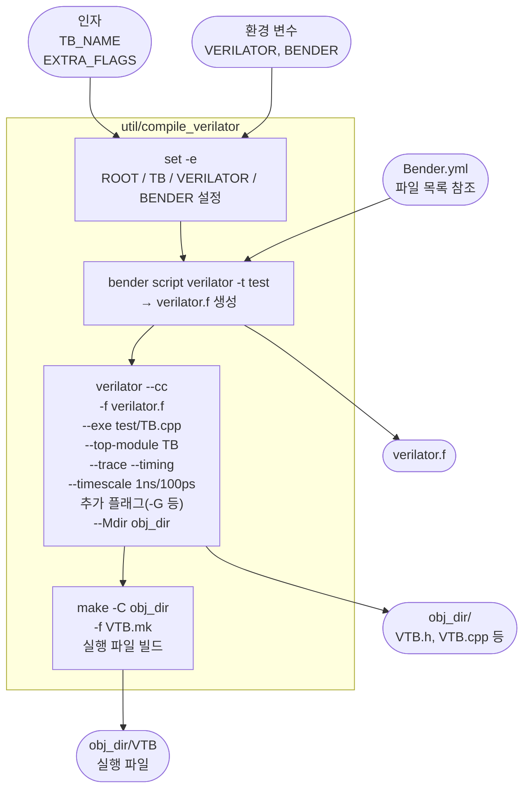

# util/compile_verilator

## 개요

Bender를 이용해 Verilator 시뮬레이션을 컴파일하고 빌드하는 **Bash 스크립트**입니다.  
`bender script verilator`로 파일 목록(`verilator.f`)을 생성한 뒤,  
Verilator로 C++ 모델을 생성하고 `make`로 실행 파일까지 빌드합니다.

[`util/compile_vsim`](compile_vsim.md)과 동일한 역할을 Verilator에 대해 수행합니다.  
시뮬레이션 실행은 [`util/run_verilator`](run_verilator.md)가 담당합니다.

## 인자

```bash
util/compile_verilator [TB_NAME] [EXTRA_VERILATOR_FLAGS...]
```

| 인자 | 기본값 | 설명 |
|------|--------|------|
| `TB_NAME` | `tb_clk_rst_gen` | 컴파일할 테스트벤치 이름 (top module 이름) |
| `EXTRA_VERILATOR_FLAGS` | (없음) | Verilator에 추가로 전달할 플래그 (예: `-GTbRstClkCycles=5`) |

## 환경 변수

| 변수 | 기본값 | 설명 |
|------|--------|------|
| `VERILATOR` | `verilator` | Verilator 실행 파일 경로 |
| `BENDER` | `bender` | Bender 실행 파일 경로 |

## 동작 순서

1. **`set -e`** — 이후 명령이 하나라도 실패하면 즉시 스크립트 종료
2. **`ROOT` 설정** — 스크립트 위치 기준으로 저장소 루트 경로 결정
3. **`TB` 설정** — 첫 번째 인자로 테스트벤치 이름 결정 (기본값: `tb_clk_rst_gen`)
4. **`bender script verilator`** — Bender가 `test` 타겟 기준으로 파일 목록 생성
   - 출력 형식: `+define+TARGET_VERILATOR` 등 define 플래그 + SV 파일 경로
   - 결과를 `$ROOT/verilator.f`로 저장
5. **`verilator --cc`** — C++ 시뮬레이션 모델 생성
   - `-f verilator.f`: Bender가 생성한 파일 목록 사용
   - `--exe $ROOT/test/${TB}.cpp`: C++ 테스트 드라이버 포함
   - `--top-module ${TB}`: 시뮬레이션 top module 지정
   - `--trace`: VCD 파형 덤프 활성화
   - `--timing`: SystemVerilog 시간 지연(`#delay`) 지원
   - `--timescale 1ns/100ps`: 타임스케일 설정
   - `"$@"`: 추가 인자(예: `-G` 파라미터 오버라이드) 전달
   - `--Mdir $ROOT/obj_dir`: 생성 파일 출력 디렉터리
6. **`make -C obj_dir`** — Verilator가 생성한 Makefile로 실행 파일 빌드
   - `-f "V${TB}.mk"`: 해당 테스트벤치의 Makefile 사용
   - `> /dev/null`: 빌드 출력 억제

## Block Diagram



## 생성되는 파일

| 경로 | 설명 |
|------|------|
| `verilator.f` | Bender가 생성한 Verilator용 파일 목록 및 define 플래그 |
| `obj_dir/V${TB}.h` | Verilator가 생성한 DUT C++ 헤더 |
| `obj_dir/V${TB}.cpp` | Verilator가 생성한 DUT C++ 구현 |
| `obj_dir/V${TB}.mk` | Verilator가 생성한 빌드용 Makefile |
| `obj_dir/V${TB}` | 최종 시뮬레이션 실행 파일 |

## Verilator 옵션 설명

| 옵션 | 설명 |
|------|------|
| `--cc` | C++ 출력 모드 (SystemC 모드 대신) |
| `-f verilator.f` | 파일 목록 파일 입력 (`+define+`, 파일 경로 포함) |
| `--exe` | C++ main 파일을 함께 컴파일하여 단독 실행 파일 생성 |
| `--top-module` | 시뮬레이션 최상위 모듈 지정 |
| `--trace` | VCD 파형 덤프 지원 활성화 |
| `--timing` | `#delay`, `@(posedge clk)` 등 시간 기반 동작 지원 |
| `--timescale` | 타임스케일 설정 (기본 단위/정밀도) |
| `--Mdir` | 생성 파일 저장 디렉터리 지정 |

## 사용 방법

```bash
# 기본 실행 (tb_clk_rst_gen 컴파일)
util/compile_verilator

# 파라미터 오버라이드와 함께 실행
util/compile_verilator tb_clk_rst_gen -GTbRstClkCycles=5

# 커스텀 Verilator 경로 지정
VERILATOR=/opt/verilator/bin/verilator util/compile_verilator
```

## compile_vsim과의 비교

| 항목 | `compile_vsim` | `compile_verilator` |
|------|---------------|---------------------|
| 대상 툴 | QuestaSim | Verilator |
| 파일 목록 생성 | `bender script vsim` → `compile.tcl` | `bender script verilator` → `verilator.f` |
| 컴파일 결과 | QuestaSim 라이브러리 | C++ 실행 파일 (`obj_dir/V${TB}`) |
| 파라미터 오버라이드 | `run_vsim`에서 `-g`로 런타임 지정 | `-G` 플래그로 컴파일 타임 지정 |
| 빌드 단계 | 1단계 (vsim이 컴파일) | 2단계 (verilator → make) |

## 관련 파일

- [`util/run_verilator`](run_verilator.md): 컴파일 후 시뮬레이션 실행 스크립트
- [`util/compile_vsim`](compile_vsim.md): QuestaSim용 동일 역할 스크립트
