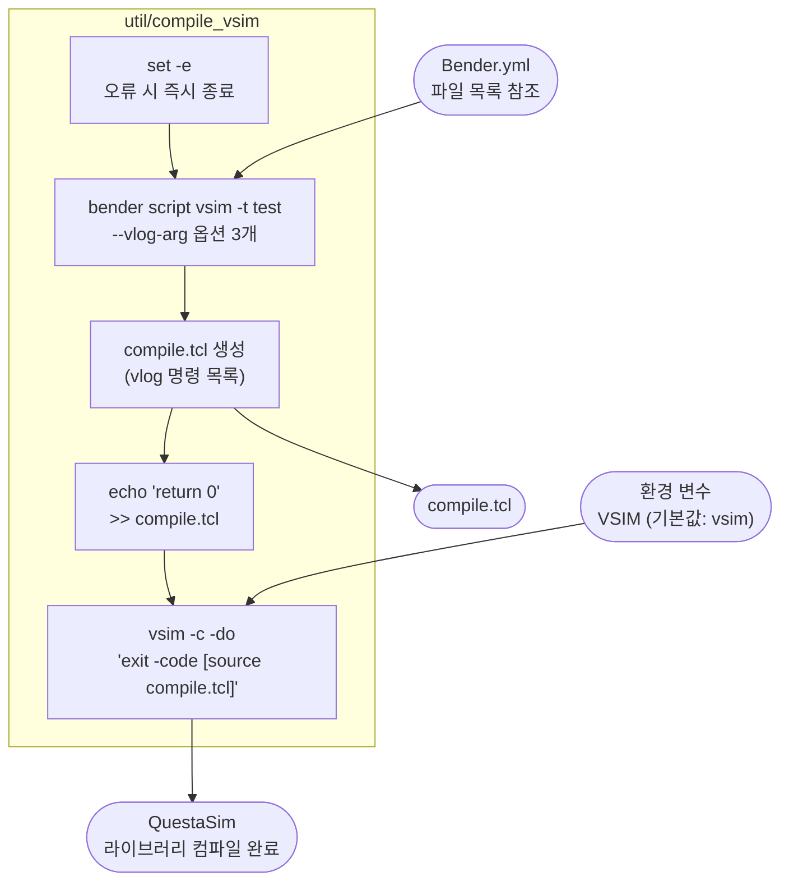

# util/compile_vsim

## 개요

Bender를 이용해 QuestaSim(ModelSim) 컴파일 스크립트를 생성하고 실행하는 **Bash 스크립트**입니다.  
`bender script vsim`으로 TCL 컴파일 스크립트(`compile.tcl`)를 생성한 뒤,  
QuestaSim을 배치(batch) 모드로 실행하여 소스 파일을 라이브러리에 컴파일합니다.

시뮬레이션 실행은 [`util/run_vsim`](run_vsim.md)이 담당합니다.

## 환경 변수

| 변수 | 기본값 | 설명 |
|------|--------|------|
| `VSIM` | `vsim` | QuestaSim 실행 파일 경로. 커스텀 설치 경로 지정 시 사용 |

## 동작 순서

1. **`set -e`** — 이후 명령이 하나라도 실패하면 즉시 스크립트 종료
2. **`VSIM` 설정** — 환경 변수 미설정 시 기본값 `vsim` 사용
3. **`bender script vsim`** — Bender가 `test` 타겟 기준으로 컴파일 TCL 스크립트 생성
   - `-t test`: `test` 타겟 활성화 (테스트벤치 포함)
   - `--vlog-arg="-svinputport=compat"`: SV 입력 포트 호환 모드
   - `--vlog-arg="-override_timescale 1ns/1ps"`: 전역 타임스케일 1ns/1ps 강제 적용
   - `--vlog-arg="-suppress 2583"`: 경고 2583(타임스케일 관련) 억제
   - 결과를 `compile.tcl`로 저장
4. **`echo 'return 0'`** — TCL 스크립트 끝에 성공 코드 추가 (QuestaSim `source` 명령의 반환값으로 사용)
5. **`$VSIM -c -do '...'`** — QuestaSim 배치 실행
   - `-c`: GUI 없이 콘솔 모드 실행
   - `-do 'exit -code [source compile.tcl]'`: `compile.tcl` 실행 후 반환 코드로 종료

## Block Diagram



## 생성되는 파일

| 파일 | 설명 |
|------|------|
| `compile.tcl` | Bender가 생성한 QuestaSim용 `vlog` 명령 목록. `run_vsim` 실행 전 반드시 먼저 생성되어야 함 |

## vlog 옵션 설명

| 옵션 | 설명 |
|------|------|
| `-svinputport=compat` | SV `input` 포트를 Verilog 호환 모드로 처리 |
| `-override_timescale 1ns/1ps` | 모든 모듈의 타임스케일을 1ns/1ps로 통일 |
| `-suppress 2583` | 타임스케일 선언 누락 경고 억제 |

## 사용 방법

```bash
# 기본 실행
util/compile_vsim

# 커스텀 vsim 경로 지정
VSIM=/opt/questasim/bin/vsim util/compile_vsim
```

## 관련 파일

- [`util/run_vsim`](run_vsim.md): 컴파일 후 시뮬레이션 실행 스크립트
- [`util/compile_verilator`](compile_verilator.md): Verilator용 동일 역할 스크립트
