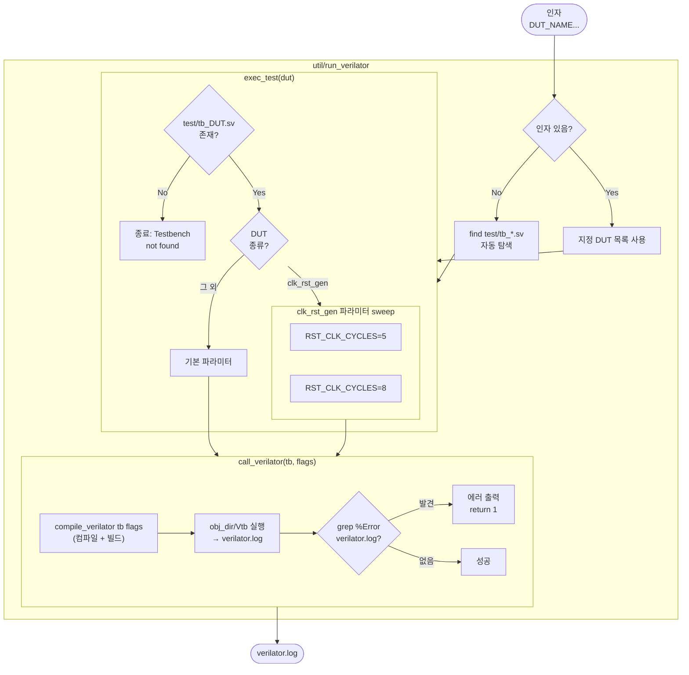

# util/run_verilator

## 개요

Verilator 시뮬레이션을 컴파일하고 실행하는 **Bash 스크립트**입니다.  
[`util/compile_verilator`](compile_verilator.md)를 내부적으로 호출하여 컴파일과 실행을 한 번에 처리하며,  
시뮬레이션 출력에서 에러를 감지하면 비정상 종료합니다.

[`util/run_vsim`](run_vsim.md)과 동일한 역할을 Verilator에 대해 수행합니다.

## 인자

```bash
util/run_verilator [DUT_NAME...]
```

| 인자 | 설명 |
|------|------|
| `DUT_NAME` | 실행할 DUT 이름 (예: `clk_rst_gen`). 미지정 시 `test/tb_*.sv` 전체 자동 탐색 |

## 함수

### `call_verilator(tb, [flags...])`

| 단계 | 동작 |
|------|------|
| 1 | `compile_verilator $tb $flags` 호출 — 컴파일 및 빌드 |
| 2 | `obj_dir/V${tb}` 실행 — 시뮬레이션 출력을 `tee`로 `verilator.log`에 저장 |
| 3 | `grep "^%Error" verilator.log` — 에러 발생 시 메시지 출력 후 `return 1` |

### `exec_test(dut_name)`

테스트벤치 파일 존재 여부를 확인하고, DUT별 파라미터 조합으로 `call_verilator`를 호출합니다.

| DUT | 동작 |
|-----|------|
| `clk_rst_gen` | `TbRstClkCycles = 5, 8` 두 값으로 각각 컴파일 후 실행 |
| 그 외 | 기본 파라미터로 컴파일 후 실행 |

> **참고**: `TbClkPeriod`는 `time` 타입으로 Verilator가 `-G` 오버라이드에서 time 리터럴을 지원하지 않아 sweep 대상에서 제외됩니다.

## 동작 순서

```
인자 파싱
  ├─ 인자 없음 → test/tb_*.sv 자동 탐색 (*_pkg.sv 제외)
  └─ 인자 있음 → 지정된 DUT 목록 사용
       ↓
exec_test(dut) 반복 실행
  ├─ test/tb_{dut}.sv 존재 확인
  └─ DUT별 파라미터 sweep
       ↓
call_verilator(tb, flags)
  ├─ compile_verilator 호출 (컴파일 + 빌드)
  ├─ 시뮬레이션 실행 → verilator.log
  └─ %Error 감지 시 실패
```

## Block Diagram



## 생성되는 파일

| 파일 | 설명 |
|------|------|
| `verilator.log` | 시뮬레이션 표준 출력 저장. `%Error` 감지용 |
| `verilator.f` | `compile_verilator` 경유로 생성되는 Bender 파일 목록 |
| `obj_dir/V${TB}` | `compile_verilator` 경유로 빌드되는 실행 파일 |
| `obj_dir/tb_clk_rst_gen.vcd` | 시뮬레이션 파형 파일 |

## 에러 감지 방식

Verilator 시뮬레이션에서 `$error` 시스템 태스크는 프로세스 종료 코드에 영향을 주지 않습니다.  
따라서 시뮬레이션 출력(`verilator.log`)을 직접 파싱하여 `%Error`로 시작하는 줄을 탐지합니다.

| 시뮬레이션 결과 | 출력 예시 | 감지 방법 |
|----------------|----------|----------|
| 정상 종료 | `- tb.sv:51: Verilog $finish` | `%Error` 없음 → 성공 |
| `$error` 발생 | `%Error: tb.sv:47: ...` | `grep "^%Error"` → 실패 |
| `$fatal` 발생 | 프로세스 비정상 종료 | exit code 비정상 → `set -e` 로 감지 |

## 사용 방법

```bash
# 전체 테스트 자동 실행
util/run_verilator

# 특정 DUT만 실행
util/run_verilator clk_rst_gen

# 여러 DUT 지정
util/run_verilator clk_rst_gen sim_timeout
```

## run_vsim과의 비교

| 항목 | `run_vsim` | `run_verilator` |
|------|-----------|----------------|
| 컴파일 | 별도로 `compile_vsim` 선행 필요 | 내부에서 `compile_verilator` 자동 호출 |
| 파라미터 오버라이드 | `-g` 런타임 지정 | `-G` 컴파일 타임 지정 (재컴파일 발생) |
| `TbClkPeriod` sweep | ✅ 지원 (4ns, 7ns) | ❌ 미지원 (`time` 타입 `-G` 제한) |
| `TbRstClkCycles` sweep | ✅ 5, 8 | ✅ 5, 8 |
| 에러 감지 | `grep "Errors: 0,"` | `grep "^%Error"` |

## 관련 파일

- [`util/compile_verilator`](compile_verilator.md): 컴파일/빌드 담당 스크립트
- [`util/run_vsim`](run_vsim.md): QuestaSim용 동일 역할 스크립트
