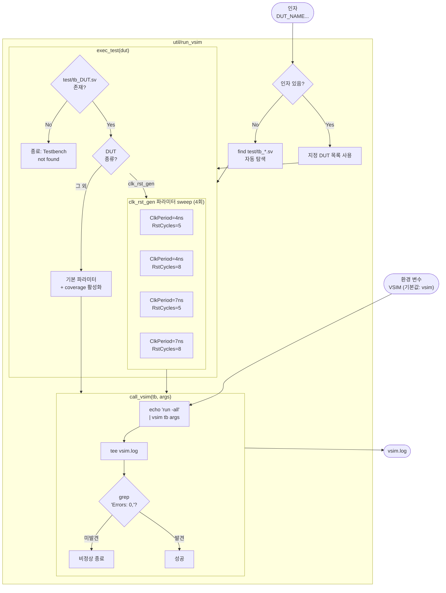

# util/run_vsim

## 개요

QuestaSim으로 시뮬레이션을 실행하는 **Bash 스크립트**입니다.  
[`util/compile_vsim`](compile_vsim.md)으로 미리 컴파일된 라이브러리를 기반으로  
DUT별 파라미터 조합을 sweep하며 시뮬레이션을 수행하고, 에러 발생 여부를 확인합니다.

[`util/run_verilator`](run_verilator.md)와 동일한 역할을 QuestaSim에 대해 수행합니다.

> **선행 조건**: 실행 전 반드시 `util/compile_vsim`을 먼저 실행해야 합니다.

## 인자

```bash
util/run_vsim [DUT_NAME...]
```

| 인자 | 설명 |
|------|------|
| `DUT_NAME` | 실행할 DUT 이름 (예: `clk_rst_gen`). 미지정 시 `test/tb_*.sv` 전체 자동 탐색 |

## 환경 변수

| 변수 | 기본값 | 설명 |
|------|--------|------|
| `VSIM` | `vsim` | QuestaSim 실행 파일 경로. 커스텀 설치 경로 지정 시 사용 |

## 함수

### `call_vsim([vsim_args...])`

| 단계 | 동작 |
|------|------|
| 1 | `echo "run -all" \| vsim "$@"` — QuestaSim 배치 실행. `run -all`로 시뮬레이션 끝까지 진행 |
| 2 | `tee vsim.log` — 출력을 화면과 `vsim.log`에 동시 저장 |
| 3 | `grep "Errors: 0," vsim.log` — QuestaSim 요약 줄에서 에러 0건 확인. 미발견 시 비정상 종료 |

### `exec_test(dut_name)`

테스트벤치 파일 존재 여부를 확인하고, DUT별 파라미터 조합으로 `call_vsim`을 호출합니다.

| DUT | 파라미터 sweep | vsim 옵션 |
|-----|--------------|----------|
| `clk_rst_gen` | `TbClkPeriod`: 4ns, 7ns × `TbRstClkCycles`: 5, 8 → 총 4회 실행 | `-t 1ns` |
| 그 외 | 파라미터 sweep 없이 1회 실행 | `-t 1ns -coverage -voptargs="+acc +cover=bcesfx"` |

## 동작 순서

```
인자 파싱
  ├─ 인자 없음 → test/tb_*.sv 자동 탐색 (*_pkg.sv 제외)
  └─ 인자 있음 → 지정된 DUT 목록 사용
       ↓
exec_test(dut) 반복 실행
  ├─ test/tb_{dut}.sv 존재 확인
  └─ DUT별 파라미터 sweep
       ↓
call_vsim(tb, vsim_args)
  ├─ echo "run -all" | vsim → 시뮬레이션 실행
  ├─ tee vsim.log
  └─ grep "Errors: 0," → 에러 확인
```

## Block Diagram



## 생성되는 파일

| 파일 | 설명 |
|------|------|
| `vsim.log` | QuestaSim 시뮬레이션 전체 출력. `Errors: 0,` 문자열 감지용 |

## vsim 옵션 설명

| 옵션 | 대상 | 설명 |
|------|------|------|
| `-t 1ns` | 전체 | 시뮬레이션 타임 해상도 1ns |
| `-gTbClkPeriod=4ns` | `clk_rst_gen` | top-level 파라미터 런타임 오버라이드 |
| `-gTbRstClkCycles=5` | `clk_rst_gen` | top-level 파라미터 런타임 오버라이드 |
| `-coverage` | 그 외 | 코드 커버리지 수집 활성화 |
| `-voptargs="+acc +cover=bcesfx"` | 그 외 | 커버리지 범위 지정 (branch/condition/expression/statement/FSM/toggle) |

## 에러 감지 방식

QuestaSim은 시뮬레이션 종료 시 아래와 같은 요약 줄을 출력합니다:

```
# Errors: 0, Warnings: 2
```

`grep "Errors: 0,"` 으로 이 줄을 탐지합니다.  
에러가 1건 이상이면 해당 줄이 존재하지 않으므로 `grep`이 실패하여 스크립트가 종료됩니다.

## 사용 방법

```bash
# 전체 테스트 자동 실행 (compile_vsim 선행 필요)
util/compile_vsim && util/run_vsim

# 특정 DUT만 실행
util/run_vsim clk_rst_gen

# 커스텀 vsim 경로 지정
VSIM=/opt/questasim/bin/vsim util/run_vsim
```

## run_verilator와의 비교

| 항목 | `run_vsim` | `run_verilator` |
|------|-----------|----------------|
| 컴파일 | `compile_vsim` 별도 선행 필요 | 내부에서 `compile_verilator` 자동 호출 |
| 파라미터 오버라이드 | `-g` 런타임 지정 (재컴파일 불필요) | `-G` 컴파일 타임 지정 (재컴파일 발생) |
| `TbClkPeriod` sweep | ✅ 4ns, 7ns | ❌ 미지원 (`time` 타입 `-G` 제한) |
| `TbRstClkCycles` sweep | ✅ 5, 8 | ✅ 5, 8 |
| 커버리지 수집 | ✅ (`-coverage`) | ❌ |
| 에러 감지 | `grep "Errors: 0,"` | `grep "^%Error"` |

## 관련 파일

- [`util/compile_vsim`](compile_vsim.md): 선행 컴파일 스크립트
- [`util/run_verilator`](run_verilator.md): Verilator용 동일 역할 스크립트
